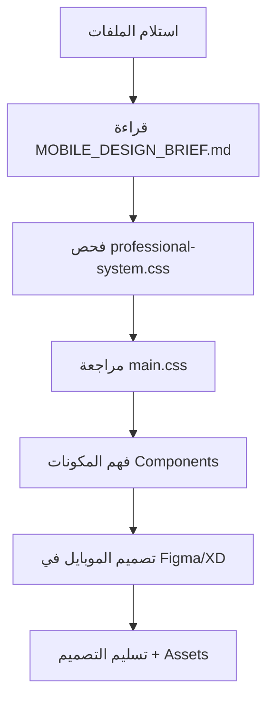

# 📦 حزمة التصميم للمصمم - Designer Package
## Quick Reference Guide

---

## 📁 **الملفات المطلوب إرسالها للمصمم**

### ✅ **المجموعة الأولى: ملفات النظام الأساسي**
```
📂 src/styles/
   ├── professional-system.css   ← نظام المتغيرات (Colors, Spacing, Typography)
   ├── main.css                  ← التصميم الأساسي للكمبيوتر
   └── mobile-fixes.css          ← التصميم الحالي للموبايل (مرجع)
```

**ما يحتويه:**
- نظام الألوان الكامل (Blue #0a2a5e, Orange #ff5b2e)
- نظام المسافات (4px → 128px)
- أحجام الخطوط (12px → 60px)
- Glass Morphism specs
- Grid system
- Breakpoints

---

### ✅ **المجموعة الثانية: ملفات المكونات**
```
📂 src/components/
   ├── BrandPageTemplate.tsx     ← قالب صفحات DIOX & AYLUX
   ├── SubPageTemplate.tsx       ← قالب الصفحات الفرعية
   ├── Header.tsx                ← الهيدر الرئيسي
   ├── Footer.tsx                ← الفوتر
   ├── Hero.tsx                  ← قسم البطل الرئيسي
   ├── BrandsSection.tsx         ← قسم العلامات التجارية
   ├── AboutSection.tsx          ← قسم من نحن
   ├── NumbersSection.tsx        ← قسم الأرقام
   ├── WorkSection.tsx           ← قسم أعمالنا
   └── GoalSection.tsx           ← قسم أهدافنا
```

**ما يحتويه:**
- بنية HTML/JSX لكل مكون
- الـ Classes المستخدمة
- التفاعلات والحركات
- حالات الـ States

---

### ✅ **المجموعة الثالثة: ملفات الصفحات**
```
📂 src/pages/
   ├── Home.tsx                  ← الصفحة الرئيسية (كل الأقسام)
   ├── DioxPage.tsx              ← صفحة علامة DIOX
   ├── AyluxPage.tsx             ← صفحة علامة AYLUX
   ├── ProductionPage.tsx        ← صفحة الإنتاج
   ├── GoalPage.tsx              ← صفحة الأهداف
   └── DryerPage.tsx             ← صفحة المجففات
```

**ما يحتويه:**
- تركيب الصفحة الكامل
- البيانات المستخدمة (Product data)
- ترتيب الأقسام

---

### ✅ **المجموعة الرابعة: الأصول البصرية**
```
📂 public/
   ├── Diox-logo.png.webp        ← لوجو DIOX
   ├── Aylux.png.webp            ← لوجو AYLUX
   ├── employees.svg             ← أيقونات الموظفين
   ├── factory.svg               ← أيقونة المصنع
   ├── 
   ├── 📂 diox/                  ← صور منتجات DIOX (34 صورة)
   │   ├── ديوكس منظف عام.png
   │   ├── ديوكس منظف زجاج.png
   │   └── ...
   │
   └── 📂 aylux/                 ← صور منتجات AYLUX (27 صورة)
       ├── ايلوكس سائل جلي.png
       ├── ايلوكس مبيض.png
       └── ...
```

**ما يحتويه:**
- جميع صور المنتجات
- اللوجوهات
- الأيقونات
- الأصول البصرية

---

### ✅ **المجموعة الخامسة: التوثيق**
```
📂 docs/
   └── MOBILE_DESIGN_BRIEF.md    ← دليل التصميم الشامل (تم إنشاؤه)
```

**ما يحتويه:**
- نظام الألوان الكامل
- نظام المسافات
- أحجام الخطوط
- Breakpoints
- أبعاد المكونات
- أمثلة بصرية
- قائمة التحقق

---

## 🎯 **طريقة الاستخدام للمصمم**

### **الخطوة 1: فهم النظام الأساسي**
```
1. افتح: professional-system.css
2. راجع المتغيرات:
   - الألوان (lines 5-24)
   - المسافات (lines 26-48)
   - الخطوط (lines 50-75)
   - الشبكة (lines 77-103)
```

### **الخطوة 2: فهم التصميم الحالي**
```
3. افتح: main.css
4. راجع الأقسام:
   - Hero section
   - Product cards
   - Brand sections
   - Footer
```

### **الخطوة 3: راجع المكونات**
```
5. افتح: src/components/BrandPageTemplate.tsx
6. راجع البنية:
   - Hero
   - Categories
   - Product grid
   - Product cards (flip effect)
```

### **الخطوة 4: افحص الصفحات**
```
7. افتح: src/pages/Home.tsx
8. راجع ترتيب الأقسام:
   - Hero → About → Brands → Numbers → Work → Goal → Footer
```

### **الخطوة 5: اطلع على الأصول**
```
9. راجع مجلد: public/diox/ و public/aylux/
10. تفحص أحجام الصور وأنواعها
```

### **الخطوة 6: اقرأ الدليل**
```
11. افتح: docs/MOBILE_DESIGN_BRIEF.md
12. اتبع المواصفات المذكورة
```

---

## 📊 **معلومات سريعة للمصمم**

### 🎨 **الألوان الرئيسية**
| اللون | Hex Code | الاستخدام |
|-------|----------|-----------|
| الأزرق الداكن | `#0a2a5e` | اللون الأساسي |
| البرتقالي | `#ff5b2e` | اللون المميز |
| الأبيض | `#ffffff` | الخلفيات |

### 📏 **المسافات الأساسية**
| الاسم | القيمة | الاستخدام |
|-------|--------|-----------|
| xs | 4px | مسافات دقيقة |
| sm | 8px | مسافات صغيرة |
| md | 16px | مسافات متوسطة |
| lg | 24px | مسافات كبيرة |
| xl | 32px | مسافات كبيرة جداً |

### ✍️ **أحجام الخطوط للموبايل**
| النوع | Desktop | Mobile |
|-------|---------|--------|
| Hero Title | 60px | 36px |
| Heading 1 | 48px | 30px |
| Heading 2 | 36px | 24px |
| Body | 16px | 16px |

### 📱 **نقاط التوقف**
| الجهاز | العرض | الاستخدام |
|--------|-------|-----------|
| Small Phone | max 480px | iPhone SE |
| Medium Phone | 481-600px | iPhone 12/13 |
| Large Phone | 601-768px | iPhone Pro Max |
| Tablet | 769-1024px | iPad |

---

## 🚀 **سير العمل الموصى به**



### **Timeline المقترح:**
- يوم 1: فهم النظام والمراجعة
- يوم 2-3: تصميم الصفحة الرئيسية (Mobile)
- يوم 4-5: تصميم صفحات العلامات (DIOX, AYLUX)
- يوم 6: تصميم الصفحات الفرعية
- يوم 7: المراجعة والتسليم

---

## 📤 **التسليمات المطلوبة من المصمم**

### ✅ **الملفات المطلوبة:**

1. **Figma/Adobe XD File**
   - جميع شاشات الموبايل (375px, 414px, 768px)
   - Design System (Colors, Typography, Components)
   - Prototypes (التفاعلات الأساسية)

2. **Assets Package**
   ```
   📦 assets-export/
      ├── icons/           (SVG Format)
      ├── images/          (WebP + PNG)
      └── logos/           (Multiple Sizes)
   ```

3. **Specifications Document**
   - قياسات دقيقة لكل عنصر
   - ألوان بصيغة Hex
   - أحجام الخطوط والسماكات
   - Spacing بين العناصر

4. **Style Guide**
   - نظام الألوان المستخدم
   - Typography scale
   - Component states (Normal, Hover, Active)
   - Animation specs

---

## ⚠️ **نقاط مهمة للمصمم**

### 🔴 **إلزامي:**
- ✅ RTL Layout (العربية من اليمين لليسار)
- ✅ Touch Targets: 44×44px minimum
- ✅ Glass Morphism في كل البطاقات
- ✅ Gradient backgrounds (Blue → Orange)
- ✅ أحجام الخطوط من النظام فقط

### 🟡 **موصى به:**
- ⭐ استخدام نفس نظام المسافات
- ⭐ الحفاظ على تناسق الألوان
- ⭐ تبسيط التفاعلات على الموبايل
- ⭐ تقليل استخدام backdrop-filter (للأداء)

### 🟢 **اختياري:**
- 💡 تحسينات في UX
- 💡 إضافة micro-interactions
- 💡 تحسين Accessibility
- 💡 Dark mode considerations

---

## 📞 **التواصل والدعم**

### الأسئلة الشائعة:

**س: هل يمكن تغيير الألوان؟**
ج: يفضل الالتزام بالألوان الأساسية، ولكن يمكن اقتراح تحسينات.

**س: هل يجب الالتزام بنفس التخطيط؟**
ج: البنية الأساسية ثابتة، ولكن يمكن تحسين الترتيب للموبايل.

**س: ما هو الإطار الزمني؟**
ج: التسليم المتوقع خلال 7 أيام عمل.

**س: ما هي أدوات التصميم المقبولة؟**
ج: Figma (مفضل)، Adobe XD، Sketch.

---

## ✅ **قائمة التحقق النهائية**

قبل التسليم، تأكد من:

- [ ] جميع الشاشات مصممة (Home, DIOX, AYLUX, Subpages)
- [ ] الألوان متطابقة مع النظام
- [ ] أحجام الخطوط من Scale المحدد
- [ ] المسافات من النظام المعياري
- [ ] Touch targets لا تقل عن 44px
- [ ] RTL layout صحيح
- [ ] Assets محسّنة (WebP, SVG)
- [ ] Prototypes تعمل
- [ ] Documentation كاملة

---

**آخر تحديث:** 15 أكتوبر 2025  
**الإصدار:** 1.0  
**المشروع:** KARAHOCA React Website  
**GitHub:** yahyaabohashemstu/karahoca

---

## 🎁 **ملاحظة للمصمم**

هذا المشروع يستخدم **Glass Morphism** بشكل مكثف، وهو أسلوب تصميم حديث يعتمد على:
- الشفافية (`opacity: 0.08`)
- Backdrop blur (`blur(16px)`)
- الحدود الشفافة
- الظلال الناعمة

**الهدف:** إنشاء تصميم موبايل احترافي يحافظ على نفس الشعور البصري للنسخة Desktop مع تحسين تجربة المستخدم على الشاشات الصغيرة! 🚀
